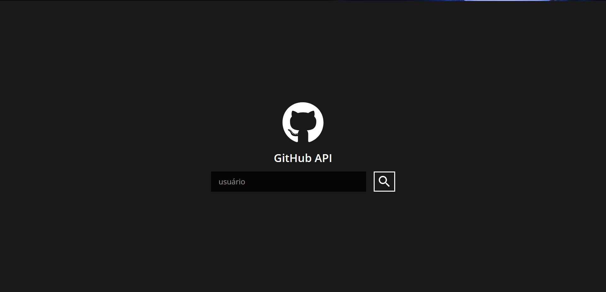
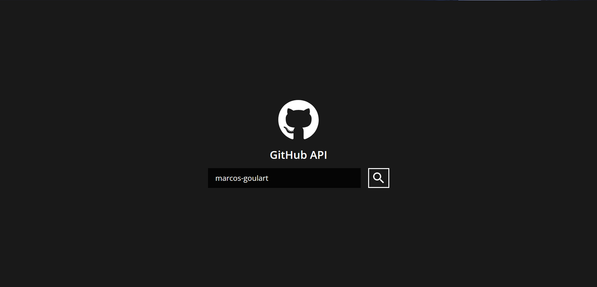
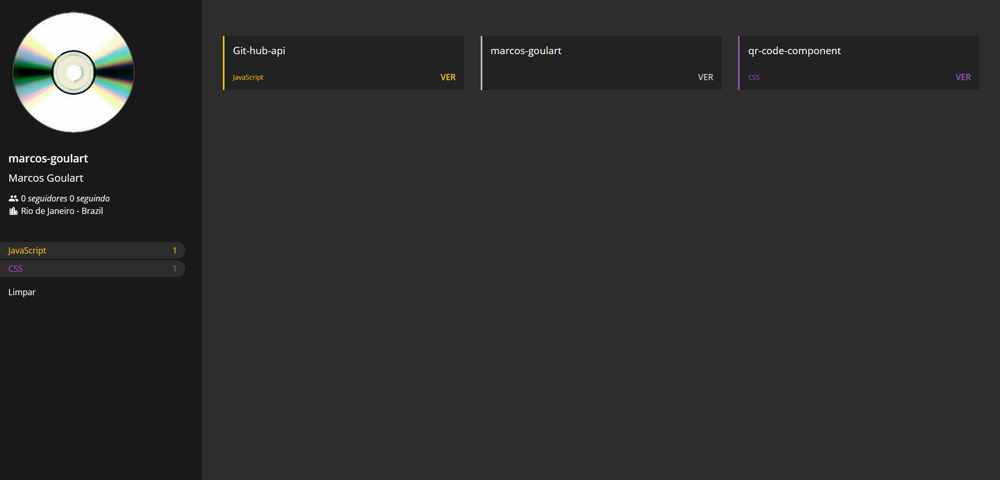

# Aplicação template

Esta é uma aplicação gerada pelo template [React básico da Dev Samurai](https://github.com/DevSamurai/cra-template-basic).

# GitHub Profile Explorer 🚀

Um aplicativo que utiliza a API do GitHub para buscar informações de um perfil e listar seus repositórios juntamente de informaçõea adicionais.

## 🔧 Tecnologias Utilizadas

- React
- Axios (para requisições HTTP)
- Styled Components (opcional)
- eslint
- nodeJS
- GitHub API

## 📦 Instalação

1. Clone este repositório:
   ```bash
   git clone https://https://github.com/marcos-goulart/Git-hub-api
   ```
2. Navegue até o diretório:
   ```bash
   cd Git-hub-api
   ```
3. Instale as dependências:
   ```bash
   npm install
   ```
4. Execute o projeto:
   ```bash
   npm start
   ```

## ⚙️ Como funciona?

- Digite um nome de usuário do GitHub.
- O sistema consulta a API e retorna os repositórios do perfil informado.

## 📸 Screenshot





## 🚀 Deploy

Caso o projeto esteja hospedado, adicione o link aqui.

